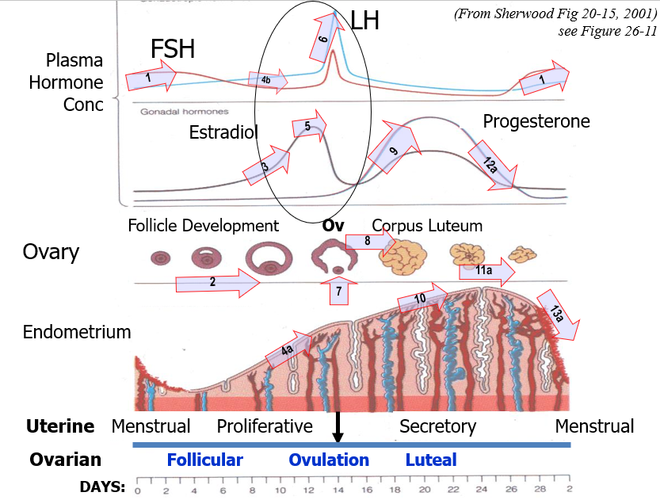

## Reproduction and Development, Part A

**1. Sex Determination**
- Sperm and egg are haploid, so they have 23 chromosomes each
- Sperm either has X or Y chromosome, so it determines sex of the baby
- SRY region of Y chromosome expresses SRY protein
- SRY protein triggers Sertoli cells to produce AMH (anti-Mullerian hormone)
    - AMH causes degeneration of Mullerian ducts
- Sertoli cells also develop Leydig cells, which produce testosterone
    - Testosterone causes development of Wolffian ducts

**2. Gametogenesis**
- Oogonia (2n) -> Primary oocyte (2n) -> Secondary oocyte (n) -> Ovum (n)
    - First polar body and second polar body are also produced but they degenerate
    - So, only one ovum is produced per primary oocyte
- Spermatogonia (2n) -> Primary spermatocyte (2n) -> Secondary spermatocyte (n) -> Spermatid (n)
    - Spermatids mature into spermatozoa (sperm)
- The primary gametocytes are diploid and 4n at the beginning of meiosis

**3. Synthesis Pathways for Steroid Hormones**
- Cholesterol is the precursor for all steroid hormones
- Certain enzymes for producing steroid hormones are only found in certain cells
- Androgens are produced in Leydig cells

**4. Regulation of Spermatogenesis**
- GnRH -> FSH and LH
- FSH stimulates Sertoli cells to produce ABP (androgen-binding protein) to keep test in high concentration
    - ABP stimulates spermatogenesis
    - Sertoli cells produce inhibin, which inhibits FSH
- LH stimulates Leydig cells to produce testosterone
    - Testosterone stimulates spermatogenesis
    - Testosterone directly _inhibits_ GnRH and LH, and indirectly FSH

**Regulation of Ovarian Cycle**
- Follicles in ovaries contain oocytes and produce estrogen
- When follice matures, it ruptures and releases egg
    - Fmbriae sweep the egg into the fallopian tube, and cilia sweep the egg towards the uterus
    - If fertilization occurs, the zygote implants in the endometrium of uterus (now a blastocyst)
    - If fertilization does not occur, the endometrium is shed during menstruation
- After follice ruptures, it becomes the corpus luteum
    - Corpus luteum produces progesterone, which maintains the endometrium
    - If fertilization occurs, the corpus luteum is maintained by hCG
        - hCG is produced by the blastocyst
        - hCG maintains the corpus luteum so that it can continue to produce progesterone until placenta takes over
    - Without hCG, corpus luteum degenerates, progesterone levels drop, and endometrium is shed
- Role of FSH and LH
    - Hypothalamus releases GnRH which stimulates FSH and LH release
    - In early cycle FSH stimulates follicle development
    - In late cycle LH stimulates ovulation (rupture of follicle) and corpus luteum formation (which produces progesterone)
- Role of estrogen and progesterone
    - Estrogen is produced by follicles, so FSH stimulates estrogen production
    - Estrogen stimulates endometrial growth
    - Progesterone is produced by corpus luteum, so LH stimulates progesterone production
    - Estrogen and progesterone inhibit FSH and LH release
        - This is a negative feedback loop
        - The goal of the loop is to regulate the menstrual cycle
- Very important image:

**6. Lactation**
- Prolactin (anterior): stimulates milk production in mammary glands
- Oxycotin (posterior): stimulates milk ejection from mammary glands by contracting smooth muscle

