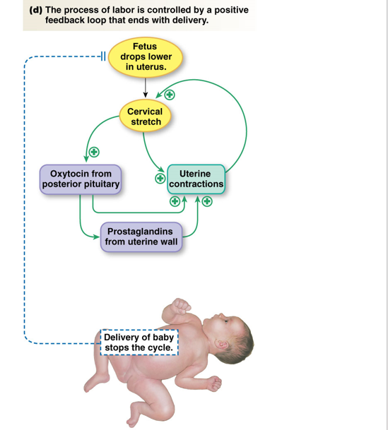

## Reproduction and Development, Part B

**1. Coitus**
- **Phases**
    - Exictement, Plateau, Orgasm, Resolution
- **Male Response**
    - Erection: CNS and spinal integration
        - Penile arteriole dilation
    - Emission
    - Ejaculation
    - ED
**2. Pornography is bad for marital relationships**

**3. Prengancy Prevention**
- Barrier methods
- Surgical methods
- Hormonal methods
- Most effective: IUD, implant, sterilization
- **Plan B**:
    - Pill contains estrogen and progesterone
    - Delays ovulation, but ineffective after LH surge or ovulation already ocurred

**4. Fertilization**
- Capacitated sperm are sperm that are in female reproductive tract and have undergone changes to be able to fertilize egg
- Capacitated sperm binds to zona pellucida after crossing corona radiata
    - Acrosomal reaction: release of enzymes to digest zona pellucida
    - Sperm fuses with egg membrane
- Elimination of second polar body

**5. The Placenta**
- Placenta is formed from chorion and endometrium
- Some material can diffuse across placenta, but others require active transport

**6. The Race for Survival**
- Implanted blastocyst secretes hCG
- hCG maintains corpus luteum
- Corpus luteum produces progesterone and estrogen
- Progesterone and estrogen maintains endometrium

**7. Hormone Changes during Pregnancy**
- hCG spikes during first trimester, then drops
- Progesterone and estrogen increase throughout pregnancy

**8. Labor**
- Fetus drops lower in uterus
- **Positive Feedback Loop**
    - Cervical stretch stimulates oxytocin release and uterine contractions
    - Oxycotin stimulates prostaglandin release
    - Oxytocin and prostaglandin stimulate more uterine contractions
    - More uterine contractions stimulate more cervical stretch
    - Only delivery of baby stops the loop
- Cervical dilation -> expulsion of fetus -> expulsion of placenta

**9. Menopause**
- Ovaries stop responding to FSH and LH from GnRH
- Lower levels of estrogen and progesterone

**10. Andropause**
- Lower levels of testosterone
- Affects 50% of men over 50
